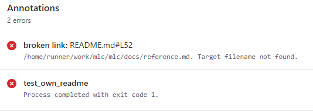

# Markup Link Checker

[](https://crates.io/crates/mlc)
[](https://crates.io/crates/mlc)
[](https://github.com/becheran/mlc/actions/workflows/rust.yml)
[](https://opensource.org/licenses/mit)
[](https://github.com/becheran/mlc/blob/master/CONTRIBUTING.md)

[](https://asciinema.org/a/299100)

Check for broken links in markup files. Currently `html` and `markdown` files are supported. The Markup Link Checker can easily be integrated in your CI pipeline to prevent broken links in your markup docs.

## Features

* Find and check links in `markdown` and `html` files
* Support HTML links and plain URLs in `markdown` files
* Validated absolute and relative file paths and URLs
* User friendly command line interface
* Easy [CI pipeline integration](#ci-pipeline-integration)
* Very fast execution using [async](https://rust-lang.github.io/async-book/)
* Efficient link resolving strategy which tries with minimized network load
* Throttle option to prevent *429 Too Many Requests* errors
* Configure via config file
* Report broken links via GitHub workflow commands

## Install Locally

There are different ways to install and use *mlc*.

### Cargo

Use rust's package manager [cargo](https://doc.rust-lang.org/cargo/) to install *mlc* from [crates.io](https://crates.io/crates/mlc):

``` bash
cargo install mlc
```

### Download Binaries

To download a compiled binary version of *mlc* go to [github releases](https://github.com/becheran/mlc/releases) and download the binaries compiled for `x86_64-unknown-linux-gnu` and `x86_64-apple-darwin`.

## CI Pipeline Integration

### GitHub Actions

Use *mlc* in GitHub using the *GitHub-Action* from the [Marketplace](https://github.com/marketplace/actions/markup-link-checker-mlc).

``` yaml
- name: Markup Link Checker (mlc)
  uses: becheran/mlc@v0.16.3
```

Use *mlc* command line arguments using the `with` argument:

``` yaml
- name: Markup Link Checker (mlc)
  uses: becheran/mlc@v0.16.3
  with:
    args: ./README.md
```

The action does uses [GitHub workflow commands](https://docs.github.com/en/actions/using-workflows/workflow-commands-for-github-actions) to highlight broken links:



### Binary

To integrate *mlc* in your CI pipeline running in a *linux x86_64 environment* you can add the following commands to download the tool:

``` bash
curl -L https://github.com/becheran/mlc/releases/download/v0.16.3/mlc-x86_64-linux -o mlc
chmod +x mlc
```

For example take a look at the [ntest repo](https://github.com/becheran/ntest/blob/master/.github/workflows/ci.yml) which uses *mlc* in the CI pipeline.

### Docker

Use the *mlc* docker image from the [docker hub](https://hub.docker.com/repository/docker/becheran/mlc) which includes *mlc*.

## Usage

Once you have *mlc* installed, it can be called from the command line. The following call will check all links in markup files found in the current folder and all subdirectories:

``` bash
mlc
```

Another example is to call *mlc* on a certain directory or file:

``` bash
mlc ./docs
```

Call *mlc* with the `--help` flag to display all available cli arguments:

``` bash
mlc -h
```

The following arguments are available:

| Argument         | Short | Description |
|------------------|-------|-------------|
| `<directory>`    |       | Only positional argument. Path to directory which shall be checked with all sub-dirs. Can also be a specific filename which shall be checked. |
| `--help`         | `-h`  | Print help |
| `--debug`        | `-d`  | Show verbose debug information |
| `--offline`      | `-o`  | Do not check any web links. Renamed from `--no-web-links` which is still an alias for downwards compatibility |
| `--match-file-extension` | `-e`  | Set the flag, if the file extension shall be checked as well. For example the following markup link `[link](dir/file)` matches if for example a file called `file.md` exists in `dir`, but would fail when the `--match-file-extension` flag is set. |
| `--version`      | `-V` | Print current version of mlc |
| `--ignore-path`  | `-p` | Comma separated list of directories or files which shall be ignored. For example  |
| `--ignore-links` | `-i` | Comma separated list of links which shall be ignored. Use simple `?` and `*` wildcards. For example `--ignore-links "http*://crates.io*"` will skip all links to the crates.io website. See the [used lib](https://github.com/becheran/wildmatch) for more information.  |
| `--markup-types` | `-t` | Comma separated list list of markup types which shall be checked [possible values: md, html] |
| `--root-dir`     | `-r` | All links to the file system starting with a slash on linux or backslash on windows will use another virtual root dir. For example the link in a file `[link](/dir/other/file.md)` checked with the cli arg `--root-dir /env/another/dir` will let *mlc* check the existence of `/env/another/dir/dir/other/file.md`. |
| `--throttle`     | `-T` | Number of milliseconds to wait in between web requests to the same host. Default is zero which means no throttling. Set this if you need to slow down the web request frequency to avoid `429 - Too Many Requests` responses. For example with `--throttle 15`, between each http check to the same host, 15 ms will be waited. Note that this setting can slow down the link checker. |

All optional arguments which can be passed via the command line can also be configured via the `.mlc.toml` config file in the working dir where *mlc* is started:

``` toml
# Print debug information to console
debug = true
# Do not check web links
offline = true
# Check the exact file extension when searching for a file
match-file-extension= true
# List of files and directories which will be ignored
ignore-path=["./ignore-me","./src"]
# List of links which will be ignored
ignore-links=["http://ignore-me.de/*","http://*.ignoresub-domain/*"]
# List of markup types which shall be checked
markup-types=["Markdown","Html"]
# Wait time in milliseconds between http request to the same host
throttle= 100
# Path to the root folder used to resolve all relative paths
root-dir="./"
```

## Changelog

Checkout the [changelog file](https://github.com/becheran/mlc/blob/master/CHANGELOG.md) to see the changes between different versions.

## License

This project is licensed under the *MIT License* - see the [LICENSE file](https://github.com/becheran/mlc/blob/master/LICENSE) for more details.
